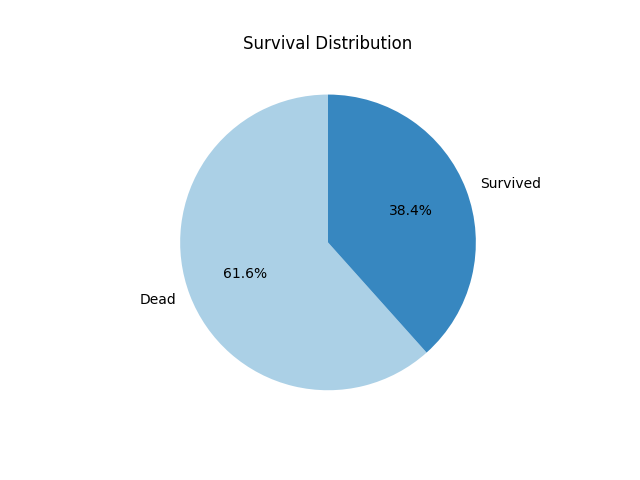
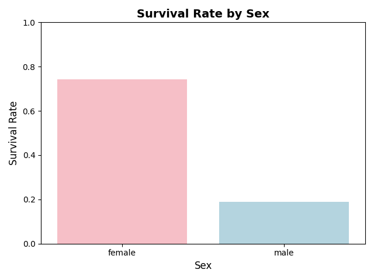
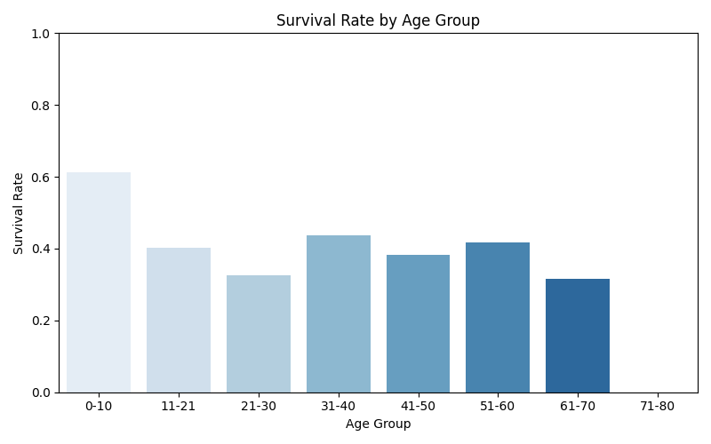
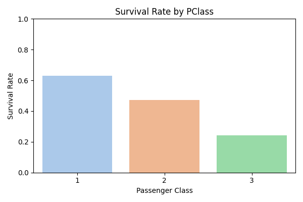
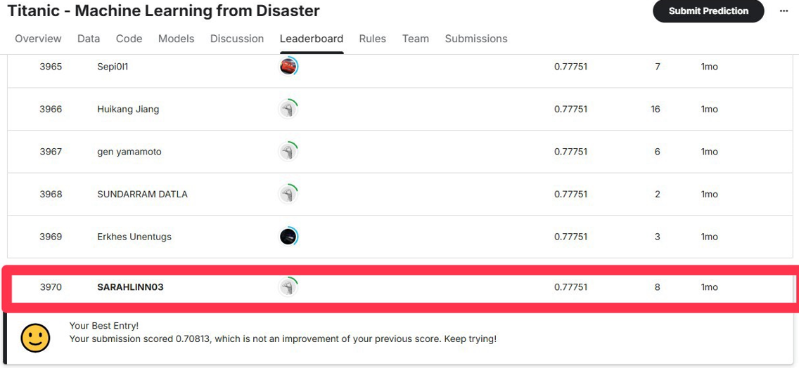

# Titanic 生存預測分析（Kaggle）

本專案為參與 Kaggle Titanic 生存預測競賽之實作練習，目的為預測乘客是否生還。整體流程包含資料清理、缺失值處理、特徵工程、模型訓練與預測評估。

## 使用工具
- Python (Pandas, Seaborn, Matplotlib, Sklearn)

## 分析步驟
1. 資料前處理（缺失值補齊、特徵轉換）
2. 特徵工程（Title、IsAlone、Fare 分群等）
3. 建立模型（Logistic Regression）
4. 模型評估與提交結果

## 資料視覺化

### 生存與死亡率

- 死亡人數多於生存人數，顯示本資料集可能有不平衡的類別分佈，後續建模時需注意分類效果。

### 生存率 vs 性別

- 女性乘客的生存率遠高於男性，顯示性別為強關聯變數。這與當時「女性與孩童優先」的救援規則相符，因此性別在模型中佔有重要角色。

### 生存率 vs 年齡

- 年齡在 0–10 歲族群的生存率最高，而 21–30 歲區間的生存率相對最低。可推測孩童與年長者在危難時更優先獲得救援，年齡具有明顯的非線性關聯性。

### 生存率 vs 艙等

- 乘客艙等與生存率呈現正相關，第一艙等的生存率高於第二、第三艙等，顯示社經地位可能影響獲救機會。艙等亦可能與其他變數（票價、登船港口）共同影響結果。

## 成果
- 最終提交 Kaggle 分數為 **0.7751**
- 模型為 Logistic Regression
- 成功進入前 25% 排名

[我的 Kaggle 參賽頁面連結 (https://www.kaggle.com/competitions/titanic/leaderboard))]

